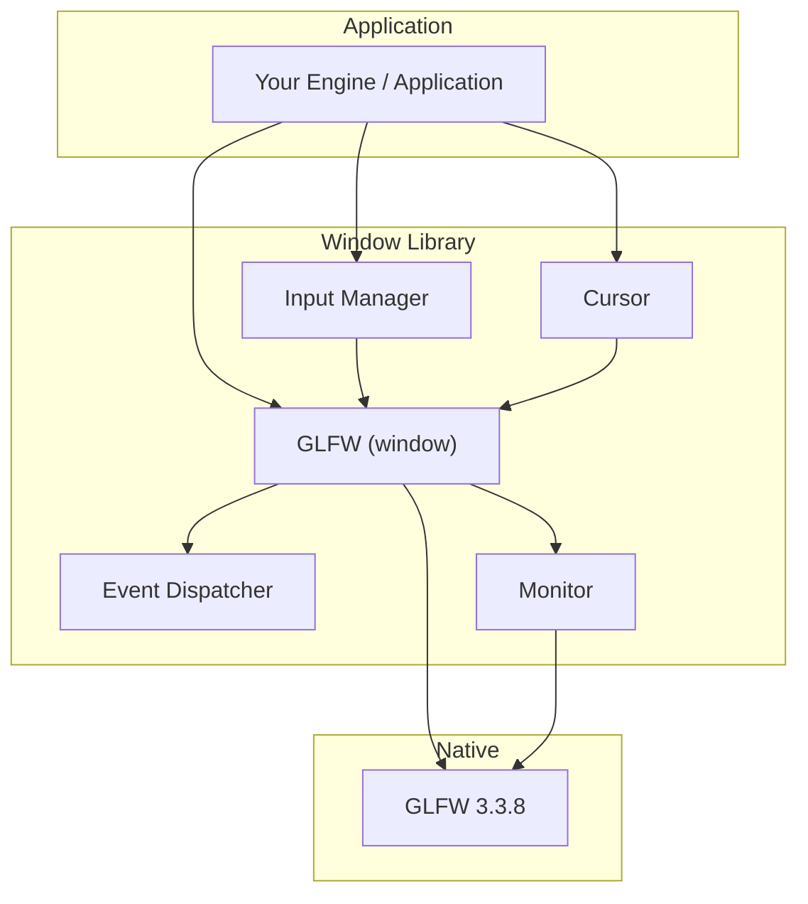

# Window

A modern C++23 shared library that wraps [GLFW](https://www.glfw.org/) into a type-safe, event-driven windowing layer for game engines and graphics applications. Window handles platform window lifecycle, input, cursor control, and display enumeration — with support for both **Vulkan** and **OpenGL** rendering backends.

---

## Table of Contents

- [Architecture](#architecture)
- [Requirements](#requirements)
- [Getting Started](#getting-started)
  - [1. Build Third-Party Dependencies](#1-build-third-party-dependencies)
  - [2. Configure the Project](#2-configure-the-project)
  - [3. Build the Library](#3-build-the-library)
  - [4. Run Tests](#4-run-tests)
- [Usage](#usage)
  - [Creating a Window](#creating-a-window)
  - [Handling Events](#handling-events)
  - [Polling Input State](#polling-input-state)
  - [Managing the Cursor](#managing-the-cursor)
- [Configuration](#configuration)
- [Project Structure](#project-structure)
- [Tested Platforms](#tested-platforms)
- [Dependencies](#dependencies)

---

## Architecture




**Event flow:** GLFW native callbacks are bound inside `GLFW::bindEventCallbacks()` and forwarded to registered listeners through `Eventing::Dispatcher::Invoke()`. Listeners receive strongly typed `IEvent` derivatives and can discriminate on `EEventType`.

**Namespace layout:**


| Namespace          | Purpose                             |
| ------------------ | ----------------------------------- |
| `Window`           | Core window and monitor types       |
| `Window::Eventing` | Event types and dispatcher          |
| `Window::Inputs`   | Keyboard and mouse abstractions     |
| `Window::Cursor`   | Cursor position, mode, and shape    |
| `Window::Utils`    | Shared geometry types and utilities |


---

## Requirements


| Tool                | Version                                  |
| ------------------- | ---------------------------------------- |
| **CMake**           | ≥ 3.25                                   |
| **C++ Compiler**    | Clang 21.1.0 (tested) with C++23 support |
| **Build Generator** | Ninja                                    |
| **Python**          | 3.x (for dependency build script)        |
| **Vulkan SDK**      | Required when `WINDOW_USE_VULKAN=ON`     |


---

## Getting Started

### 1. Build Third-Party Dependencies

Run the build script `thirdparty/build_dependencies.py` from the project root. This compiles GLFW from source and stages headers, libraries, and runtime binaries into `thirdparty/`.

**Linux / macOS**

```sh
python3 thirdparty/build_dependencies.py
```

**Windows**

```sh
python thirdparty\build_dependencies.py
```

The script produces:

```
thirdparty/
├── include/    # GLFW headers
├── libs/       # Static/import libraries (.lib, .a, .dylib)
└── bins/       # Runtime libraries (.dll, .so, .pdb)
```

### 2. Configure the Project

Window uses [CMake Presets](https://cmake.org/cmake/help/latest/manual/cmake-presets.7.html) for reproducible builds. Three configure presets are available:


| Preset    | Build Type | Purpose                                     |
| --------- | ---------- | ------------------------------------------- |
| `debug`   | Debug      | Development builds with symbols             |
| `release` | Release    | Optimized production builds                 |
| `tests`   | Debug      | Enables `BUILD_TESTING` and the test target |


```sh
cmake --preset debug
```

All presets default to **Vulkan mode** (`WINDOW_USE_VULKAN=ON`). See [Configuration](#configuration) for OpenGL builds.

### 3. Build the Library

```sh
cmake --build --preset debug
```

Build artifacts are written to:

```
bin/<architecture>/<os>/<Configuration>/
```

For example, on Windows x64 in Debug mode:

```
bin/amd64/windows/Debug/
├── Window.dll
├── glfw3.dll
└── Window.lib
```

### 4. Run Tests

```sh
cmake --preset tests
cmake --build --preset tests
ctest --preset tests
```

The test executable (`window_tests`) and its runtime dependencies are placed in `bin/<arch>/<os>/Tests/`.

---

## Usage

Link against the `Window` shared library and include headers from `include/`.

### Creating a Window

```cpp
#include "window/glfw.hpp"

int main()
{
    Window::WindowInit init {
        .Title = "My Application",
        .Size  = { .Width = 1280, .Height = 720 },
    };

    Window::GLFW window { init };

    while (!window.ShouldClose())
    {
        window.PollEvents();

#ifndef WINDOW_USE_VULKAN
        // Render with OpenGL, then present
        window.SwapBuffers();
#endif
    }

    return 0;
}
```

### Handling Events

`GLFW` inherits from `Eventing::Dispatcher`. Register listeners to react to window and input events:

```cpp
#include "window/glfw.hpp"
#include "window/eventing/window_events.hpp"
#include "window/eventing/input_events.hpp"

Window::GLFW window;

window.AddListener([](Window::Eventing::IEvent& event) {
    using namespace Window::Eventing;

    switch (event.GetEventType())
    {
    case EEventType::WindowResize: {
        auto& e = static_cast<WindowResizeEvent&>(event);
        // Handle resize: e.GetWidth(), e.GetHeight()
        break;
    }
    case EEventType::KeyPress: {
        auto& e = static_cast<KeyPressEvent&>(event);
        // Handle key: e.GetKey()
        break;
    }
    case EEventType::MouseScroll: {
        auto& e = static_cast<MouseScrollEvent&>(event);
        // Handle scroll: e.GetOffsetX(), e.GetOffsetY()
        break;
    }
    default:
        break;
    }
});
```

Listeners are identified by `ListenerID` and can be removed at any time:

```cpp
auto id = window.AddListener(myCallback);
window.RemoveListener(id);
```

### Polling Input State

For frame-synchronous input checks, use `InputManager`:

```cpp
#include "window/inputs/input_manager.hpp"

Window::Inputs::InputManager input { window };

if (input.IsKeyPressed(Window::Inputs::EKey::Escape))
    window.SetShouldClose(true);

if (input.IsMouseButtonPressed(Window::Inputs::EMouseButton::Left))
{
    // Primary mouse button held
}
```

### Managing the Cursor

```cpp
#include "window/cursor/cursor.hpp"

Window::Cursor::Cursor cursor { window };

cursor.SetMode(Window::Cursor::ECursorMode::Disabled);  // FPS-style capture
cursor.SetShape(Window::Cursor::ECursorShape::CrossHair);
cursor.SetPosition({ .X = 400.0, .Y = 300.0 });
```

---

## Configuration

### CMake Options


| Option              | Default                                     | Description                                                                                                                                           |
| ------------------- | ------------------------------------------- | ----------------------------------------------------------------------------------------------------------------------------------------------------- |
| `WINDOW_USE_VULKAN` | `OFF` in `CMakeLists.txt`; `ON` via presets | When enabled, creates a Vulkan-compatible window (`GLFW_NO_API`) and links against the Vulkan SDK. When disabled, creates an OpenGL 4.6 Core context. |
| `BUILD_TESTING`     | `OFF`                                       | Enables the Google Test suite (set automatically by the `tests` preset).                                                                              |


### OpenGL Build

To build with OpenGL instead of Vulkan, configure without the Vulkan flag:

```sh
cmake --preset debug -DWINDOW_USE_VULKAN=OFF
cmake --build --preset debug
```

### Vulkan Build

The provided CMake presets enable Vulkan by default. Ensure the [Vulkan SDK](https://vulkan.lunarg.com/) is installed and `Vulkan::Vulkan` is discoverable by CMake.

```sh
cmake --preset release
cmake --build --preset release
```

When using Vulkan, obtain the native window handle via `window.GetWindow()` and create your swapchain externally. `SwapBuffers()` is not available in Vulkan mode.

---

## Project Structure

```
Window/
├── include/window/          # Public API headers
│   ├── cursor/              # Cursor mode, shape, and control
│   ├── eventing/            # Event types and dispatcher
│   ├── inputs/              # Key, mouse button, and input manager
│   └── utils/               # Geometry types, comparators, NonCopyable
├── src/                     # Library implementation
├── tests/                   # Google Test suite
│   └── support/             # Test fixtures and helpers
├── thirdparty/              # Dependency build script and staged artifacts
│   └── build_dependencies.py
├── CMakeLists.txt           # Root build definition
└── CMakePresets.json        # Debug, Release, and Tests presets
```

---

## Tested Platforms


| Platform   | Status |
| ---------- | ------ |
| Windows 11 | Tested |


**Toolchain used for validation:**

- Compiler: Clang 21.1.0
- Generator: Ninja
- GLFW: 3.3.8
- C++Standard: C++23
- Unit Testing: Google Test 1.17.0

---

## Dependencies


| Dependency                                          | Version | Role                                            |
| --------------------------------------------------- | ------- | ----------------------------------------------- |
| [GLFW](https://www.glfw.org/)                       | 3.3.8   | Cross-platform windowing and context creation   |
| [Google Test](https://github.com/google/googletest) | 1.17.0  | Unit testing (fetched via CMake `FetchContent`) |
| [Vulkan SDK](https://vulkan.lunarg.com/)            | —       | Graphics API (optional, Vulkan builds only)     |


GLFW is built from source via `thirdparty/build_dependencies.py` and linked as a shared library. Google Test is downloaded automatically when `BUILD_TESTING` is enabled.